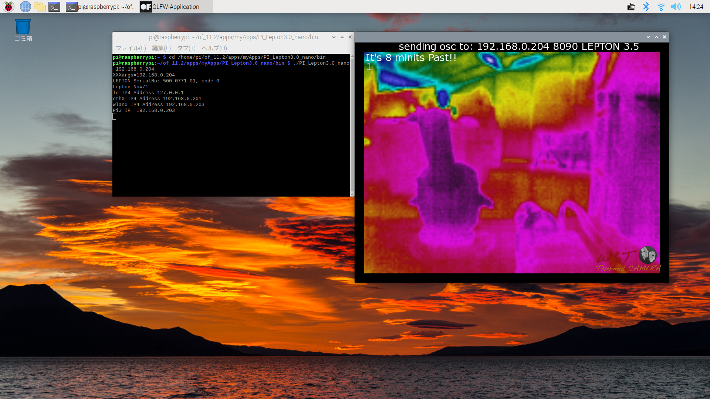
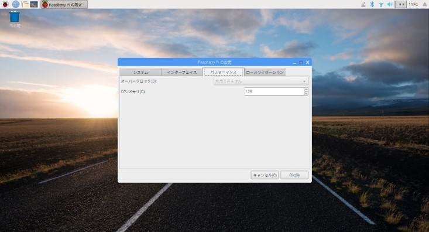
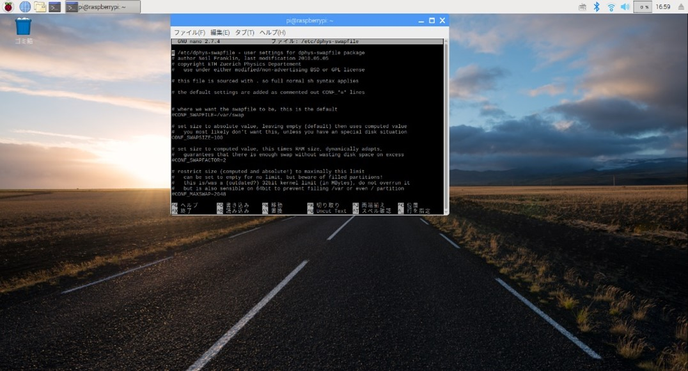

# ThermalCam3xPI
Raspberry Pi apps for iPhone ThermalCam 3X
https://apps.apple.com/jp/app/thermal-cam3x/id1289239410

## Required main Material
- FLIR Lepton 3.5 or FS https://ctl-commerce.com/shopdetail/000000000044/camera/page1/order/
- Raspberry PI 3 or 4
- Breakout Board for FLIR Lepton
https://ctl-commerce.com/shopdetail/000000000042/

## for Raspberry Pi4B

install Bullseye 32bit according officail instruction.

**$ sudo apt update**

**$ sudo apt upgrade**

**$ sudo nano /boot/config.txt**

#uncomment to overclock the arm. 700 MHz is the default.

over_voltage=5

arm_freq=1000

force_turbo=1

gpu_freq=400

GPU setting to 256

-Change Pi setting
- [x] spi
- [x] ssh
- [x] i2c

or change raspi-config

**$ reboot**

## install OpenFrameworks
https://openframeworks.cc/setup/raspberrypi/raspberry-pi-getting-started/

Install packages and compile openFrameworks:

**$ cd**

wget https://github.com/openframeworks/openFrameworks/releases/download/0.11.2/of_v0.11.2_linuxarmv6l_release.tar.gz

**$ mkdir of_11.2**

**$ tar vxfz of_v0.11.2_linuxarmv6l_release.tar.gz -C of_11.2 --strip-components 1**

**cd /home/pi/of_11.2/scripts/linux/debian**

**yes | sudo ./install_dependencies.sh**

**make Release -C /home/pi/of_11.2/libs/openFrameworksCompiled/project**

copy Lepton3.0_nano to myApps

**$ cd of_11.2/apps/myApps/PI_Lepton3.X**

**($ make clean)**

**$ make -j4**

$ cd bin

**to make run essential to add ip address of Jetson Nano :**

**to display thermal image, you can add whatever ip address for example : ./PI_Lepton3.X　192.168.0.204**

$ cd ~/

$ nano .bashrc

export DISPLAY=:0

## for Raspberry Pi3B

**install Stretch**

https://downloads.raspberrypi.org/raspbian/images/raspbian-2019-04-09/2019-04-08-raspbian-stretch.zip

force_turbo=1

arm_freq=1300

over_voltage=5

**For 3B 16MB GPU memory(G) to 128**

**to compile Openframeworks swapfile to 1024**

**$ sudo nano /etc/dphys-swapfile**

**CONF_SWAPSIZE=1024**

**$ sudo apt update**

**$ sudo apt upgrade**

-Change Pi setting
- [x] spi
- [x] ssh
- [x] i2c

or change raspi-config

**$ reboot**

## install OpenFrameworks for Pi3B (OF_10.1 not OF_11.2)

https://openframeworks.cc/setup/raspberrypi/raspberry-pi-getting-started/

**Install packages and compile openFrameworks:**

**$ cd**

~~wget https://github.com/openframeworks/openFrameworks/releases/download/0.11.2/of_v0.11.2_linuxarmv6l_release.tar.gz~~

**$ wget https://openframeworks.cc/versions/v0.10.1/of_v0.10.1_linuxarmv6l_release.tar.gz**

**$ mkdir of_10.1**

~~$ tar vxfz of_v0.11.2_linuxarmv6l_release.tar.gz -C of_11.2 --strip-components 1~~

**$ tar vxfz of_v0.10.1_linuxarmv6l_release.tar.gz -C of_10.1 --strip-components 1**

**$ cd /home/pi/of_10.1/scripts/linux/debian**

**$ yes | sudo ./install_dependencies.sh**

**$ make Release -C /home/pi/of_10.1/libs/openFrameworksCompiled/project**

copy Lepton3.0_nano to myApps

**$ cd of_11.2/apps/myApps/PI_Lepton3.X**

**($ make clean)**

**$ make -j4**

$ cd bin

**to make run essential to add ip address of iPhone or iPad :**

**to display thermal image, you can add whatever ip address for example : ./PI_Lepton3.X　192.168.0.204**

$ cd ~/

$ nano .bashrc

export DISPLAY=:0

